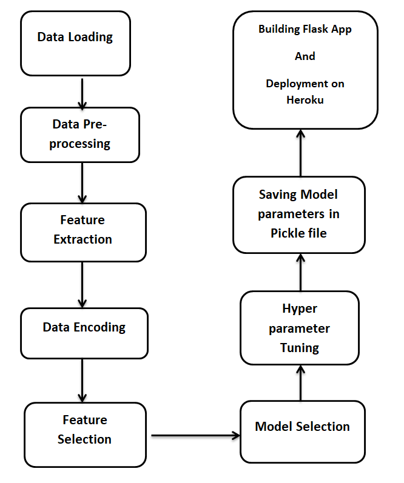

# Flight_Price_Prediction
## Description
A machine learning web app that predicts the price of the flight based on several features. The model is built using Random forest regressor with a R2 score of 81.38% after going through Hyper Parameter tuning(RandomizedSearchCV).

The web application was developed using flask framework and deployed using heroku and the link for the application is https://flight-prices-prediction-app.herokuapp.com/

## How to use the application
<ul>
<li>The user has to enter the various parameters asked in form like arrival date,departure date,source ,destination,stopage and airline name.</li>
<li>Then press the submit button</li>
<li>After which the machine learning model at the backend will predict the price of flight.</li>
</ul>

## About Dataset
<ul>
<li>The dataset used for training the model is  https://www.kaggle.com/nikhilmittal/flight-fare-prediction-mh.</li>
<li>Dataset contains 10683 rows and 11 columns</li>
<li>Features are - Airline , Date of Journey, Source, destination, Route, Departure time, Arrival time, Duration, Total Stops, Additional info</li>
</ul>

## Model Selection
6 regressor models were tried out of which random forest regressor performed really well. Here are the test scores for the models:
<ul>
<li>Random Forest - 83.24%</li>
<li>KNN - 52.2%</li>
<li>Ridge regressor - 58.6%</li>
<li>Lasso regressor - 60.7%</li>
<li>Decision Tree regressor - 73.9% </li>
<li>XGB regressor - 83.03%</li>
</ul>

## Flowchart of Methodology

## I/O screenshots
### Input

### Output

## Authors
Ayush Goel

## License
[MIT](https://choosealicense.com/licenses/mit/)
